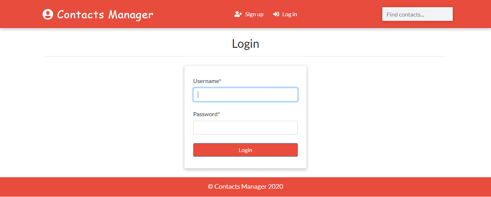

<h1 align="center">Contact-Manager-App</h1>
<a href="#">
  <div align="center">
    
  </div>
</a>

## Functionalities
- [x] User Authentication
- [x] Search
- [x] Real Time Update from Admin
- [x] Delete
- [x] Filter according to gender
- [x] Profile Image


## How To Run
```
git clone https://github.com/sadiqabubakar526/CONTACT-MANAGEMENT-APP.git
cd CONTACT-MANAGEMENT-APP
python manage.py runserver
```
## Access to the Admin Panel
```
python manage.py createsuperuser
```

## Author


You can also follow my GitHub Profile to stay updated about my latest projects: [](https://github.com/sadiqabubakar526)
